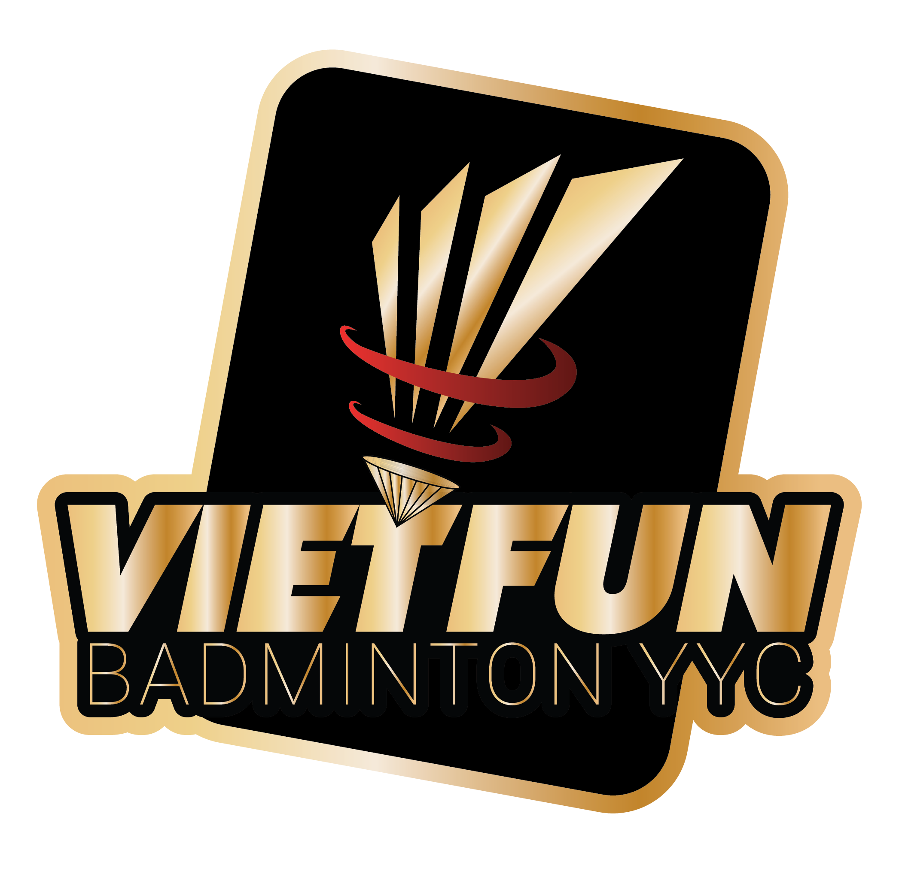

# Badminton Poll




## 📋 Overview

Badminton Poll is a web application designed for badminton groups to organize court bookings and track player participation. It allows administrators to create polls for upcoming play dates, manage court bookings, and enables players to indicate their availability.

## ✨ Features

- **Poll Management**: Create, edit, close, and reopen polls for badminton sessions
- **Player Registration**: Track player participation and generate player lists
- **Cost Calculation**: Automatically calculate and distribute costs based on participation
- **Admin Dashboard**: Complete overview of polls, players, and voting statistics
- **Mobile-Friendly Interface**: Responsive design for desktop and mobile devices

## 🏗️ System Architecture

The application follows Laravel's MVC architecture:

### Models

- **Poll**: Manages badminton session details (date, courts, hours, pricing)
- **Player**: Handles player information and availability
- **Vote**: Tracks player responses to polls

### Key Features

- UUID-based identification for secure data handling
- Timestamp management for poll scheduling
- Automated cost calculation and distribution

## 🛠️ Technical Details

### Database Structure

- **polls**: Stores session information (date, courts, hours, pricing, status)
- **players**: Maintains player records
- **votes**: Links players to polls with voting status

### Configuration Constants

- Maximum players: 16
- Default court price: $30/hour
- Default booking: 2 courts for 5 hours
- Default play day: Saturday
- Tax rate: 5%

## 🔧 Installation

### Step 1: Clone the repository

```bash
git clone https://your-repository-url/badminton-poll.git
cd badminton-poll
```

### Step 2: Install dependencies

```bash
composer install
npm install
```

### Step 3: Set up environment

```bash
cp .env.example .env
php artisan key:generate
```

### Step 4: Configure database in .env file

```env
DB_CONNECTION=mysql
DB_HOST=127.0.0.1
DB_PORT=3306
DB_DATABASE=badminton_poll
DB_USERNAME=root
DB_PASSWORD=
```

### Step 5: Run migrations

```bash
php artisan migrate
```

### Step 6: Compile assets

```bash
npm run dev
```

### Step 7: Start the server

```bash
php artisan serve
```

## 🚀 Usage

### User Interface

- **Home**: View and participate in the latest poll
- **Latest List**: See current participant list
- **Rule**: Review participation rules

### Admin Panel

- Access the admin dashboard at `/admin/dashboard`
- Create and manage polls
- View participation statistics
- Close polls and calculate costs

## ☕️ Buy me a coffee

https://ko-fi.com/tommydo

## 📝 License

This project is open-sourced software licensed under the [MIT license](https://opensource.org/licenses/MIT).


